---
## Front matter
title: "Лабораторная работа №6"
subtitle: "Простейший вариант"
author: "Кучеренко София"

## Generic otions
lang: ru-RU
toc-title: "Содержание"

## Bibliography
bibliography: bib/cite.bib
csl: pandoc/csl/gost-r-7-0-5-2008-numeric.csl

## Pdf output format
toc: true # Table of contents
toc-depth: 2
lof: true # List of figures
lot: true # List of tables
fontsize: 12pt
linestretch: 1.5
papersize: a4
documentclass: scrreprt
## I18n polyglossia
polyglossia-lang:
  name: russian
  options:
	- spelling=modern
	- babelshorthands=true
polyglossia-otherlangs:
  name: english
## I18n babel
babel-lang: russian
babel-otherlangs: english
## Fonts
mainfont: PT Serif
romanfont: PT Serif
sansfont: PT Sans
monofont: PT Mono
mainfontoptions: Ligatures=TeX
romanfontoptions: Ligatures=TeX
sansfontoptions: Ligatures=TeX,Scale=MatchLowercase
monofontoptions: Scale=MatchLowercase,Scale=0.9
## Biblatex
biblatex: true
biblio-style: "gost-numeric"
biblatexoptions:
  - parentracker=true
  - backend=biber
  - hyperref=auto
  - language=auto
  - autolang=other*
  - citestyle=gost-numeric
## Pandoc-crossref LaTeX customization
figureTitle: "Рис."
tableTitle: "Таблица"
listingTitle: "Листинг"
lofTitle: "Список иллюстраций"
lotTitle: "Список таблиц"
lolTitle: "Листинги"
## Misc options
indent: true
header-includes:
  - \usepackage{indentfirst}
  - \usepackage{float} # keep figures where there are in the text
  - \floatplacement{figure}{H} # keep figures where there are in the text
---

# Цель работы

Приобрести практические навыки работы в Midnight Commander и освоить инструкций языка ассемблера mov и int.

# Выполнение лабораторной работы

1. Откроем Midnight Commander и создадим папку lab06:

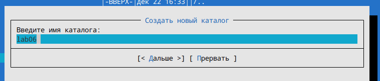

2. Cоздадим файл lab6-1.asm:

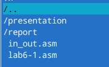

3. С помощью клавиши F4 откроем файл lab6-1.asm, введем текст программы и сохраним изменения (F2). С помощью клавиши F3 просмотрим файл:

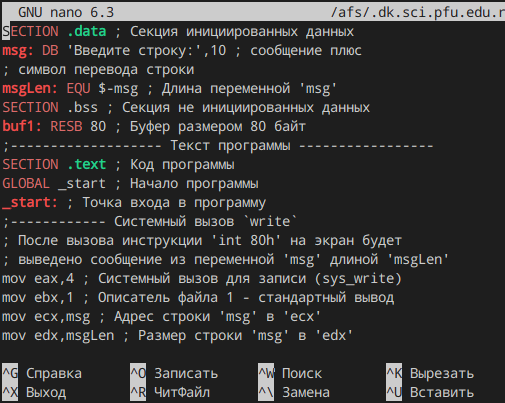

4. Создадим исполняемый файл и запустим его:

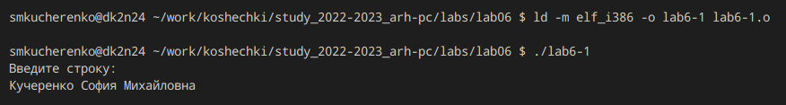

5. Скопируем файл in_out.asm с помощью клавиши F6:

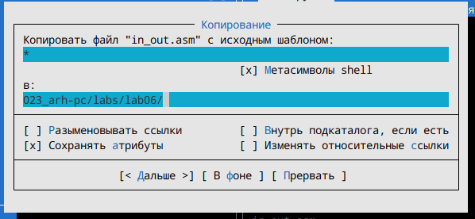

6. С помощью клавиши F6 создадим копию файла lab6-1.asm с именем lab6-2.asm:

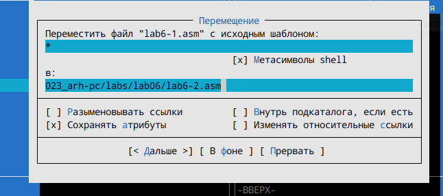

7. Исправим текст программы lab6-2.asm , создадим исполняемый файл и запустим:

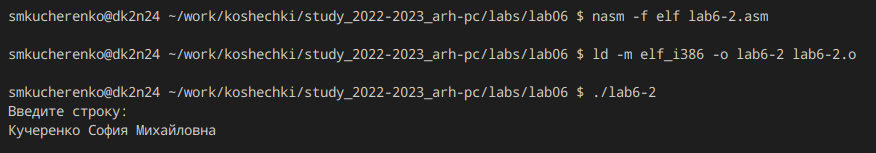

8. Заменим в файле lab6-2.asm подпрограмму sprintLF на sprint, создадим исполняемый файл и запустим(мы увидим, что строка вывелась не с новой строки):

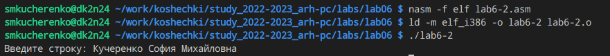

# Самостоятельная работа

1. Напишем программу, исправив код файла lab6-1.asm и проверим её работу:

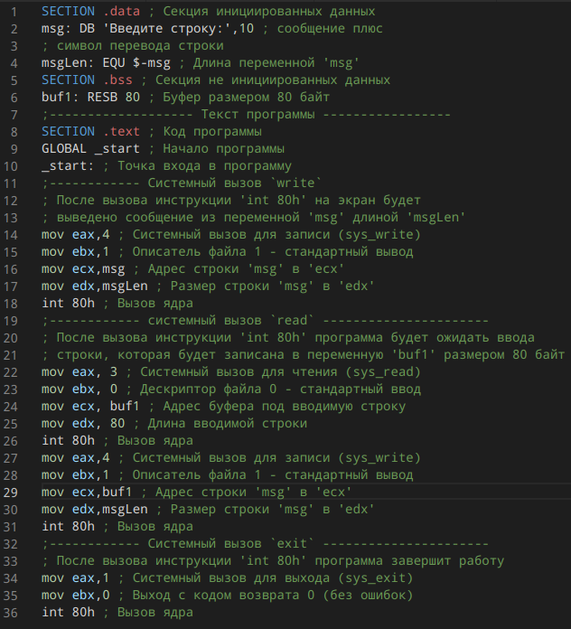

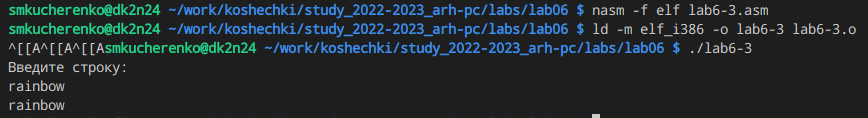

2. Напишем программу, исправив код файла lab6-2.asm и проверим её работу:

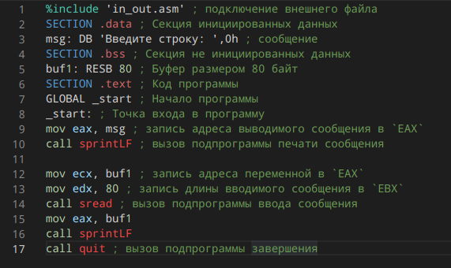

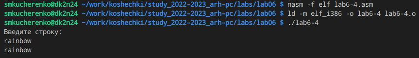

# Выводы

Я приобрела практические навыки работы в Midnight Commander и освоила инструкций языка ассемблера mov и int.
