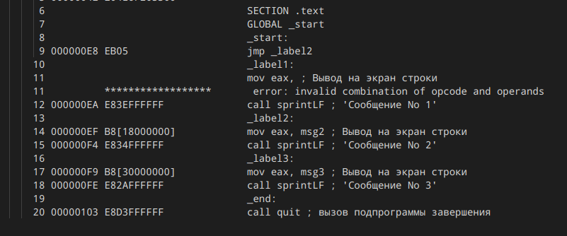

---
## Front matter
title: "Лабораторная работа №8."
subtitle: "Команды безусловного и условного переходов в Nasm."
author: "Кучеренко София."

## Generic otions
lang: ru-RU
toc-title: "Содержание"

## Bibliography
bibliography: bib/cite.bib
csl: pandoc/csl/gost-r-7-0-5-2008-numeric.csl

## Pdf output format
toc: true # Table of contents
toc-depth: 2
lof: true # List of figures
lot: true # List of tables
fontsize: 12pt
linestretch: 1.5
papersize: a4
documentclass: scrreprt
## I18n polyglossia
polyglossia-lang:
  name: russian
  options:
	- spelling=modern
	- babelshorthands=true
polyglossia-otherlangs:
  name: english
## I18n babel
babel-lang: russian
babel-otherlangs: english
## Fonts
mainfont: PT Serif
romanfont: PT Serif
sansfont: PT Sans
monofont: PT Mono
mainfontoptions: Ligatures=TeX
romanfontoptions: Ligatures=TeX
sansfontoptions: Ligatures=TeX,Scale=MatchLowercase
monofontoptions: Scale=MatchLowercase,Scale=0.9
## Biblatex
biblatex: true
biblio-style: "gost-numeric"
biblatexoptions:
  - parentracker=true
  - backend=biber
  - hyperref=auto
  - language=auto
  - autolang=other*
  - citestyle=gost-numeric
## Pandoc-crossref LaTeX customization
figureTitle: "Рис."
tableTitle: "Таблица"
listingTitle: "Листинг"
lofTitle: "Список иллюстраций"
lotTitle: "Список таблиц"
lolTitle: "Листинги"
## Misc options
indent: true
header-includes:
  - \usepackage{indentfirst}
  - \usepackage{float} # keep figures where there are in the text
  - \floatplacement{figure}{H} # keep figures where there are in the text
---

# Цель работы

Изучить команды условного и безусловного переходов и научиться писать программы с использованием этих переходов. 

# Выполнение лабораторной работы

1. Создадим файл lab8-1.asm, запишем код программы и проверим его работу:

2. Создадим файл lab8-2.asm, запишем код программы и также проверим его работу:

3. Изменим текст программы, изменив инструкции jmp и получим следующее:

4. Откроем файл с программой lab8-1.asm и в любой инструкции с двумя операндами удалим один, выполним трансляцию с получением файла листинга (nasm -f elf -l lab8-2.lst lab8-2.asm): 

5. Создадим файл lab8-3.asm, запишем код программы и проверим его работу на разных значениях B:

# Самостоятельная работа 

1. Напишем программу нахождения наименьшей из 3 целочисленных переменных и запустим её:

2. Напишем программу для нахождения значения заданной функции из введенных с клавиатуры значений:

# Выводы

Я изучила команды условного и безусловного переходов и научилась писать программы с использованием этих переходов. 